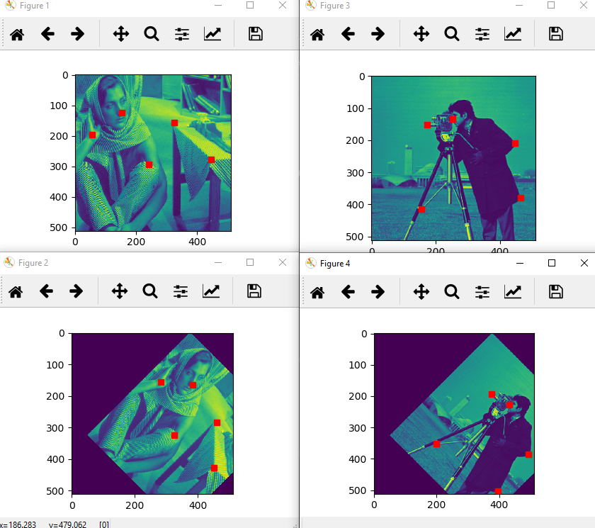
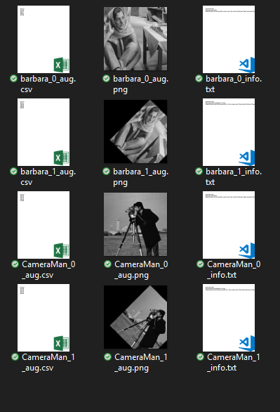

# Batch-image-and-landmark-augmentation

# Image and keypoint augmentor
based on skimage and imgaug https://github.com/aleju/imgaug

# Files!

  - PrMain_single image.py: use it as an example of augmentation on an image.
  - PrMain_single image.py: use it for batch processing.
 
# Easy for batch processing!
  - Set the source and destination folders
  - It is assumed that, for each image in source folder, there is a csv file, consists the x, y locations of landmarks. see the example file.
  - Set the all augmentation variations in the AugCongigList list (based on imgaug syntaxes)
  - Execute it. 
  - All the augmented images (.png), corresponding keypoints (.csv) and information (.txt) will be saved in the destination folder.
 

Some examples:

Destination Folder:

